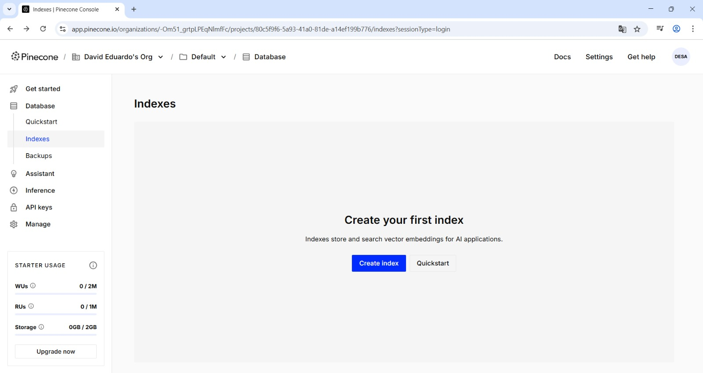
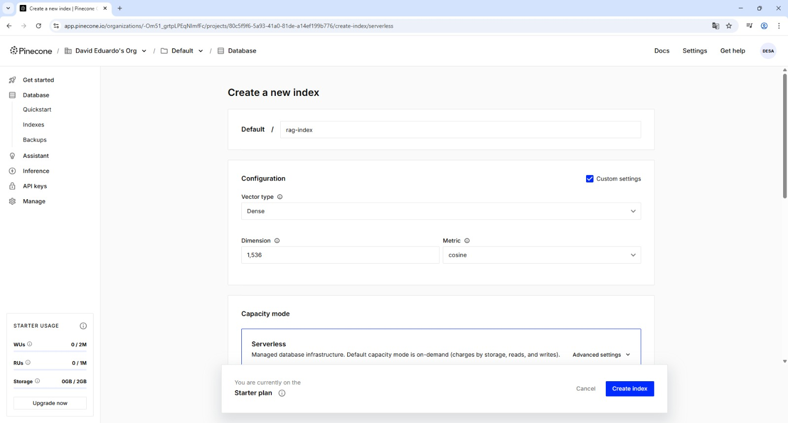
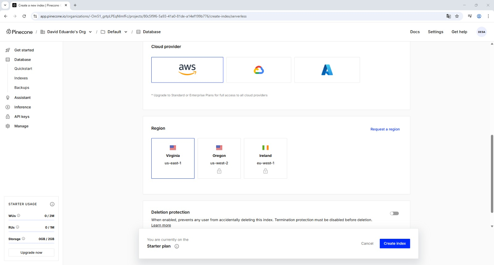

# 🔎 RAG System – OpenAI + Pinecone + LangChain

## 📌 Descripción

Este repositorio implementa un sistema Retrieval-Augmented Generation (RAG) utilizando:

- OpenAI Embeddings
- Pinecone como vector database
- LangChain RetrievalQA
- GPT-4o-mini

El sistema permite:

1. Ingestar documentos
2. Generar embeddings
3. Almacenarlos en Pinecone
4. Recuperar contexto relevante
5. Generar respuestas fundamentadas

---

## 🏗 Arquitectura

Usuario → Query → Pinecone Retriever → GPT-4o-mini → Respuesta

---

## 📁 Estructura del Proyecto

- ingest.py → Procesa documentos y genera embeddings
- query.py → Sistema interactivo de preguntas
- data/ → Carpeta con archivos .txt
- .env → Variables de entorno

---

## ⚙️ Requisitos

Python 3.10+

Instalar dependencias:

pip install langchain langchain-openai langchain-pinecone pinecone-client python-dotenv

---

## 🔐 Variables de entorno

Crear archivo `.env`:

OPENAI_API_KEY=tu_api_key
PINECONE_API_KEY=tu_api_key
PINECONE_INDEX_NAME=rag-index

---

## 🧩 Creación del Índice en Pinecone

1. Ingresar a https://app.pinecone.io
2. Crear nuevo índice
3. Configuración recomendada:

- Dimension: 1536
- Metric: cosine
- Cloud: AWS
- Region: us-east-1

### 📸 Evidencia

---

## 🚀 Ingestión

Ejecutar:

python ingest.py

Salida esperada:

Documents processed: X  
Chunks stored: X  
Index used: rag-index  
Ingestion complete.

---

## 💬 Consulta

Ejecutar:

python query.py

Ejemplo:

Ask a question: What is the document about?

---

## 🧠 Conceptos Implementados

- Retrieval-Augmented Generation (RAG)
- Embeddings semánticos
- Chunking de documentos
- Vector databases
- Similarity search
- Integración Retrieval + Generación

---

## 🎓 Conclusión

Este laboratorio demuestra cómo extender las capacidades de un LLM mediante recuperación de información externa, reduciendo alucinaciones y permitiendo respuestas basadas en documentos propios.